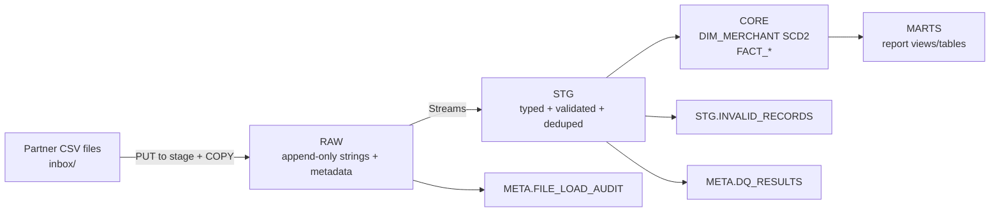
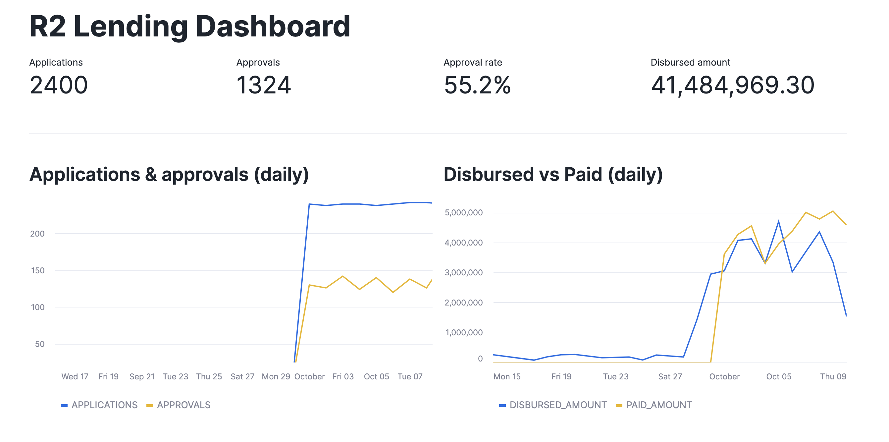
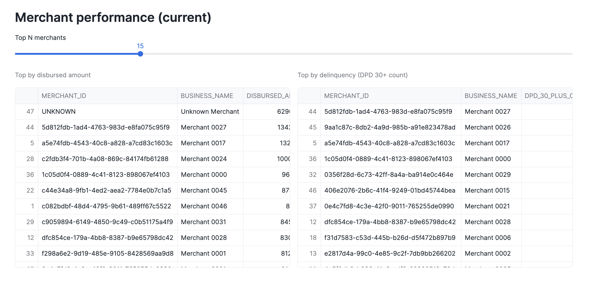
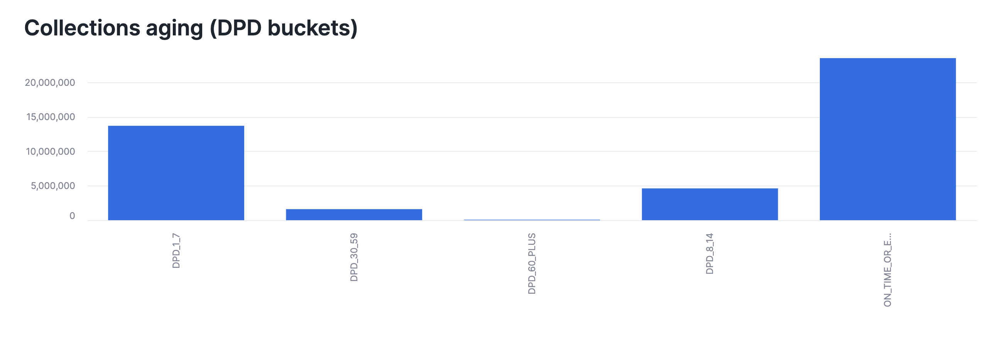

# Analytics Engineer Assessment — System Design & Architecture (Snowflake)

This repository implements a Snowflake-native ingestion + modeling pipeline for daily partner CSV drops. The design is built to handle missing headers, duplicates, late arrivals, and imperfect referential integrity, while producing BI-ready reporting marts.

---

## Goals

- Ingest daily CSV drops for:
  - `merchants_<YYYY-MM-DD>.csv`
  - `applications_<YYYY-MM-DD>.csv`
  - `disbursements_<YYYY-MM-DD>.csv`
  - `payments_<YYYY-MM-DD>.csv`
- Preserve raw inputs (append-only) with load metadata for auditability.
- Produce clean, typed, deduplicated staging tables.
- Model core analytics in a Kimball-style dimensional model:
  - SCD Type 2 Merchant Dimension (history preserved; current row flagged)
  - Fact tables at the natural grain (application, disbursement, payment)
- Publish marts/views for:
  - Processing monitoring (data ops)
  - Lending performance (business KPIs)
  - Risk monitoring (credit risk early warning)

---

## Source Data & File Conventions

### File naming
Each file name ends with a batch date suffix:
- `..._<YYYY-MM-DD>.csv`

This batch date is extracted from the filename and stored as `batch_date`. It represents the “partner snapshot date” for merchant attributes and the “delivery batch date” for transaction files.

### CSV headers
Headers **may or may not** exist. The pipeline must not rely on them.

---

## Architecture Overview

The pipeline follows a layered approach:

1. **RAW** — append-only landing tables (all columns as STRING)
2. **STG** — typed, validated, deduplicated “clean” tables + invalid quarantine
3. **CORE** — dimensional model (SCD2 dimension + fact tables)
4. **MARTS** — BI-ready report views/tables

### Why this layering?
- **RAW** preserves exactly what arrived and when (auditable).
- **STG** is where parsing, validation, and dedupe happen in a controlled way.
- **CORE** implements stable business entities and relationships (Kimball).
- **MARTS** exposes curated datasets for Tableau/Looker/BI consumers.

---

## Data Flow (High Level)



## Key Assumptions

1. batch_date is extracted from the filename suffix `YYYY-MM-DD`.

2. Merchant files represent the latest merchant attributes as-of batch_date.

3. “Default” is not explicitly provided; if needed for reporting, define a proxy:

    * Example proxy: a disbursement is “defaulted” if any payment has days_from_due >= 30

    * This threshold is configurable based on credit policy.

4. Portfolio balance is principal-only unless interest accrual rules are introduced:

    * `outstanding_principal = disbursed_amount - sum(payments)`

## Questions needing team clarification
1. What is the official definition of **default**?
    * Days Past Due threshold (30/60/90)? Charge-off? Restructuring?
2. Are there **multiple payments per disbursement** only (1:many), or can a payment be allocated across multiple disbursements?
3. Can **IDs change** (e.g. different payment_id) or are they immutable?
4. Are merchant files true **ful snapshots** or partial updates?
5. For reporting:
    * Shold KPIs be based on **event dates** (disbursement_date) or **processing dates** (batch_date)?
6. Which merchant attributes should be treated as slowly changing (SCD2) vs overwritten(SCD1)?
7. Any business rules around:
    * excluding test merchants,
    * handling refunds/reversals,
    * chargeback payments,
    * negative amounts or adjustments?

## Dashboard (Streamlit in Snowflake)

The analytics dashboard is implemented as a **Streamlit app hosted inside Snowflake**. It reads directly from the curated marts in `R2_LENDING.MARTS`:

- `MART_DAILY_OVERVIEW` — daily funnel KPIs (applications, approvals, approval rate, disbursed vs. paid)
- `MART_MERCHANT_PERFORMANCE_CURRENT` — merchant scorecard (current snapshot only)
- `MART_COLLECTIONS_AGING` — collections / delinquency proxy by DPD bucket

**App link:** https://app.snowflake.com/rptathp/jr59504/#/streamlit-apps/R2_LENDING.MARTS.Q6J8A4VVD6PCGA67

### Access & sharing
This Streamlit app is secured by Snowflake and requires a valid **Snowflake username/password** in the same account, with permissions to query `R2_LENDING.MARTS`.  
For reviewers without access, screenshots are provided below.

### Screenshots

**Overview**


**Merchant performance**


**Collections aging**


````md
---

## Runbook — Execution Order (End-to-End)

This section describes the minimal sequence to reproduce the pipeline in Snowflake.

### 0) Prerequisites
- Snowflake account access with permissions to create database/schema, stages, file formats, and tables.
- A running warehouse (e.g., `R2_AE_WH`).
- Partner files available in the Snowflake stage `R2_LENDING.META.INGEST_STAGE`.

### 1) Create database, schemas, and core objects
Run the setup SQL to create:
- Database + schemas: `RAW`, `STG`, `CORE`, `MARTS`, `META`
- File format: `R2_LENDING.META.CSV_FF`
- Stage: `R2_LENDING.META.INGEST_STAGE`

Validation:
```sql
SHOW SCHEMAS IN DATABASE R2_LENDING;
SHOW FILE FORMATS IN SCHEMA R2_LENDING.META;
SHOW STAGES IN SCHEMA R2_LENDING.META;
````

### 2) Load RAW (append-only)

Load partner files from the stage into RAW append-only tables:

* `RAW.RAW_MERCHANTS`
* `RAW.RAW_APPLICATIONS`
* `RAW.RAW_DISBURSEMENTS`
* `RAW.RAW_PAYMENTS`

**Important:** RAW loads must populate:

* `SOURCE_FILENAME` (from `METADATA$FILENAME`)
* `SOURCE_ROW_NUMBER` (from `METADATA$FILE_ROW_NUMBER`)
* `BATCH_DATE` (parsed from filename suffix `YYYY-MM-DD`)
* `LOAD_TS` (current timestamp)

Validation:

```sql
SELECT COUNT(*) FROM R2_LENDING.RAW.RAW_MERCHANTS;
SELECT COUNT_IF(batch_date IS NULL) AS null_batch FROM R2_LENDING.RAW.RAW_MERCHANTS;

SELECT COUNT(*) FROM R2_LENDING.RAW.RAW_APPLICATIONS;
SELECT COUNT(*) FROM R2_LENDING.RAW.RAW_DISBURSEMENTS;
SELECT COUNT(*) FROM R2_LENDING.RAW.RAW_PAYMENTS;
```

### 3) Build STG (typed + validated + deduped)

Create “clean” staging tables:

* `STG.MERCHANTS_CLEAN`
* `STG.APPLICATIONS_CLEAN`
* `STG.DISBURSEMENTS_CLEAN`
* `STG.PAYMENTS_CLEAN`

Validation (example pattern):

```sql
SELECT COUNT(*) FROM R2_LENDING.STG.MERCHANTS_CLEAN;
SELECT COUNT(*) FROM R2_LENDING.STG.APPLICATIONS_CLEAN;
SELECT COUNT(*) FROM R2_LENDING.STG.DISBURSEMENTS_CLEAN;
SELECT COUNT(*) FROM R2_LENDING.STG.PAYMENTS_CLEAN;
```

### 4) Build CORE (dimensional model)

Create:

* `CORE.DIM_MERCHANT` (SCD Type 2)
* `CORE.FCT_APPLICATION`
* `CORE.FCT_DISBURSEMENT`
* `CORE.FCT_PAYMENT`

Validation:

```sql
-- DIM sanity
SELECT COUNT_IF(effective_from IS NULL) AS null_eff_from
FROM R2_LENDING.CORE.DIM_MERCHANT;

SELECT COUNT(*) AS merchants_bad_current
FROM (
  SELECT merchant_id
  FROM R2_LENDING.CORE.DIM_MERCHANT
  GROUP BY 1
  HAVING COUNT_IF(is_current) != 1
);

-- FACT -> DIM coverage
SELECT COUNT_IF(merchant_sk IS NULL) AS apps_missing_dim
FROM R2_LENDING.CORE.FCT_APPLICATION;

SELECT COUNT_IF(merchant_sk IS NULL) AS disb_missing_dim
FROM R2_LENDING.CORE.FCT_DISBURSEMENT;

SELECT COUNT_IF(merchant_sk IS NULL) AS pay_missing_dim
FROM R2_LENDING.CORE.FCT_PAYMENT;

-- Optional referential checks
SELECT COUNT(*) AS disb_without_app
FROM R2_LENDING.CORE.FCT_DISBURSEMENT d
LEFT JOIN R2_LENDING.CORE.FCT_APPLICATION a
  ON a.application_id = d.application_id
WHERE a.application_id IS NULL;

SELECT COUNT(*) AS pay_without_disb
FROM R2_LENDING.CORE.FCT_PAYMENT p
LEFT JOIN R2_LENDING.CORE.FCT_DISBURSEMENT d
  ON d.disbursement_id = p.disbursement_id
WHERE d.disbursement_id IS NULL;
```

### 5) Build MARTS (BI-ready)

Create report marts (views/tables):

* `MARTS.MART_DAILY_OVERVIEW`
* `MARTS.MART_MERCHANT_PERFORMANCE_CURRENT`
* `MARTS.MART_COLLECTIONS_AGING`

Validation:

```sql
SELECT COUNT(*) FROM R2_LENDING.MARTS.MART_DAILY_OVERVIEW;
SELECT COUNT(*) FROM R2_LENDING.MARTS.MART_MERCHANT_PERFORMANCE_CURRENT;
SELECT COUNT(*) FROM R2_LENDING.MARTS.MART_COLLECTIONS_AGING;
```

---

## Part 3 — Required Reports Mapping (What implements what)

This project implements the assessment’s reporting requirements as follows:

### Report 1 — Daily Processing Summary (last ~30 days)

**Dataset:** `R2_LENDING.MARTS.MART_DAILY_OVERVIEW`
**Grain:** 1 row per day (`dt`)
**Purpose:** operational monitoring (file/volume checks) and daily funnel/throughput

Recommended filter:

```sql
SELECT *
FROM R2_LENDING.MARTS.MART_DAILY_OVERVIEW
WHERE dt >= DATEADD(day, -30, CURRENT_DATE())
ORDER BY dt;
```

### Report 2 — Lending Performance Dashboard (last ~40 days)

**Dataset:** `R2_LENDING.MARTS.MART_DAILY_OVERVIEW` (time series KPIs)
**Dataset (merchant level):** `R2_LENDING.MARTS.MART_MERCHANT_PERFORMANCE_CURRENT`
**Purpose:** applications → approvals → disbursements → repayments

Recommended filter:

```sql
SELECT *
FROM R2_LENDING.MARTS.MART_DAILY_OVERVIEW
WHERE dt >= DATEADD(day, -40, CURRENT_DATE())
ORDER BY dt;
```

### Report 3 — Weekly Risk Monitoring (weekly snapshot)

**Dataset:** `R2_LENDING.MARTS.MART_COLLECTIONS_AGING`
**Purpose:** early-warning delinquency proxy (DPD buckets) and trend monitoring

If weekly aggregation is needed:

```sql
SELECT
  DATE_TRUNC('WEEK', COALESCE(batch_date, payment_date)) AS week_start,
  CASE
    WHEN days_from_due <= 0 THEN 'ON_TIME_OR_EARLY'
    WHEN days_from_due BETWEEN 1 AND 7 THEN 'DPD_1_7'
    WHEN days_from_due BETWEEN 8 AND 14 THEN 'DPD_8_14'
    WHEN days_from_due BETWEEN 15 AND 29 THEN 'DPD_15_29'
    WHEN days_from_due BETWEEN 30 AND 59 THEN 'DPD_30_59'
    WHEN days_from_due >= 60 THEN 'DPD_60_PLUS'
    ELSE 'UNKNOWN'
  END AS dpd_bucket,
  SUM(payment_amount) AS payment_amount
FROM R2_LENDING.CORE.FCT_PAYMENT
GROUP BY 1,2
ORDER BY 1,2;
```

---

## Data Visualization Challenge (Implementation Notes)

The Streamlit dashboard is designed to tell a cohesive story across three layers:

1. **Funnel throughput (Applications → Approvals)**

* Highlights daily application volume and approval conversion.
* Used to detect pipeline issues (volume drops/spikes) and business changes.

2. **Capital flow (Disbursed vs Paid)**

* Compares disbursement volume against repayment inflows.
* Useful to identify funding velocity and repayment dynamics.

3. **Risk early-warning (DPD buckets)**

* Uses `days_from_due` as a delinquency proxy.
* Bucketed aging distribution (e.g., DPD 30+ as higher-risk segment).

Business impact:

* Enables operators to monitor ingestion stability and business users to track performance KPIs and risk signals from the same curated marts.

---

## Data Dictionary (MARTS)

### MART_DAILY_OVERVIEW

* `dt`: reporting date (derived from batch/process/event date)
* `applications`: count of applications processed on `dt`
* `approvals`: count of approved applications on `dt`
* `approval_rate`: approvals / applications
* `avg_requested_amount`: average requested amount on `dt`
* `disbursements`: count of disbursements processed on `dt`
* `disbursed_amount`: total disbursed amount on `dt`
* `payments`: count of payments processed on `dt`
* `paid_amount`: total paid amount on `dt`
* `avg_days_from_due`: average days past due for payments on `dt`
* `late_payments`: count of payments with `days_from_due > 0` on `dt`

### MART_MERCHANT_PERFORMANCE_CURRENT

(Current snapshot only; 1 row per merchant_id)

* `merchant_sk`: surrogate key (joins to `CORE.DIM_MERCHANT`)
* `merchant_id`: natural merchant identifier
* `business_name`, `industry_code`, `state_code`, `risk_score`: current merchant attributes
* `applications`, `approvals`, `approval_rate`, `avg_requested_amount`: application KPIs
* `disbursements`, `disbursed_amount`, `avg_interest_rate`: disbursement KPIs
* `payments`, `paid_amount`, `avg_days_from_due`, `dpd_30_plus_cnt`: payment/risk KPIs
* `payback_ratio`: `paid_amount / disbursed_amount` (simple repayment proxy)

### MART_COLLECTIONS_AGING

* `merchant_sk`: merchant surrogate key
* `dpd_bucket`: delinquency bucket derived from `days_from_due`
* `payments_cnt`: number of payments in the bucket
* `payment_amount`: sum of payment amounts in the bucket
* `avg_days_from_due`: average DPD in the bucket

---

```
::contentReference[oaicite:0]{index=0}
```

