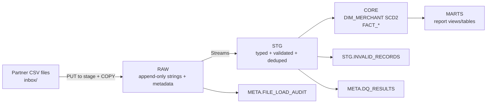

# Analytics Engineer Assessment — System Design & Architecture (Snowflake)

This repository implements a Snowflake-native ingestion + modeling pipeline for daily partner CSV drops. The design is built to handle missing headers, duplicates, late arrivals, and imperfect referential integrity, while producing BI-ready reporting marts.

---

## Goals

- Ingest daily CSV drops for:
  - `merchants_<YYYY-MM-DD>.csv`
  - `applications_<YYYY-MM-DD>.csv`
  - `disbursements_<YYYY-MM-DD>.csv`
  - `payments_<YYYY-MM-DD>.csv`
- Preserve raw inputs (append-only) with load metadata for auditability.
- Produce clean, typed, deduplicated staging tables.
- Model core analytics in a Kimball-style dimensional model:
  - SCD Type 2 Merchant Dimension (history preserved; current row flagged)
  - Fact tables at the natural grain (application, disbursement, payment)
- Publish marts/views for:
  - Processing monitoring (data ops)
  - Lending performance (business KPIs)
  - Risk monitoring (credit risk early warning)

---

## Source Data & File Conventions

### File naming
Each file name ends with a batch date suffix:
- `..._<YYYY-MM-DD>.csv`

This batch date is extracted from the filename and stored as `batch_date`. It represents the “partner snapshot date” for merchant attributes and the “delivery batch date” for transaction files.

### CSV headers
Headers **may or may not** exist. The pipeline must not rely on them.

---

## Architecture Overview

The pipeline follows a layered approach:

1. **RAW** — append-only landing tables (all columns as STRING)
2. **STG** — typed, validated, deduplicated “clean” tables + invalid quarantine
3. **CORE** — dimensional model (SCD2 dimension + fact tables)
4. **MARTS** — BI-ready report views/tables

### Why this layering?
- **RAW** preserves exactly what arrived and when (auditable).
- **STG** is where parsing, validation, and dedupe happen in a controlled way.
- **CORE** implements stable business entities and relationships (Kimball).
- **MARTS** exposes curated datasets for Tableau/Looker/BI consumers.

---

## Data Flow (High Level)

## Key Assumptions

1. batch_date is extracted from the filename suffix <YYYY-MM-DD>.

2. Merchant files represent the latest merchant attributes as-of batch_date.

3. “Default” is not explicitly provided; if needed for reporting, define a proxy:

    * Example proxy: a disbursement is “defaulted” if any payment has days_from_due >= 30

    * This threshold is configurable based on credit policy.

4. Portfolio balance is principal-only unless interest accrual rules are introduced:

    * <outstanding_principal = disbursed_amount - sum(payments)>